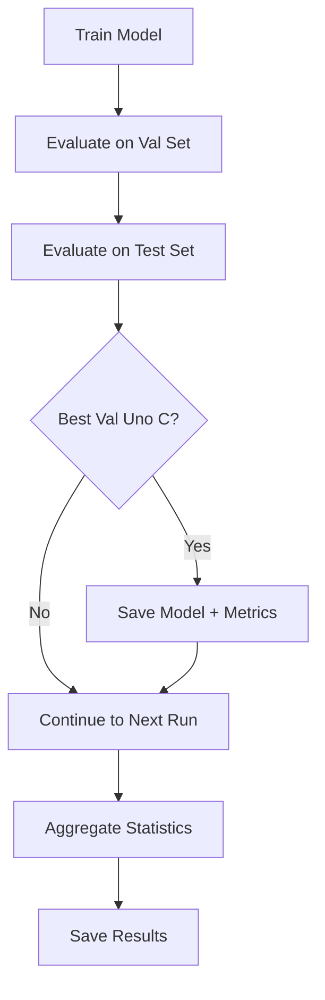

# MIMIC-IV Chest X-ray Dataset Integration

This document provides a comprehensive guide for using the MIMIC-IV Chest X-ray dataset with the ConcordancePairwiseLoss framework for survival analysis with medical images.

## Overview

The MIMIC-IV Chest X-ray integration provides a streamlined workflow for survival analysis using chest X-ray images with **comprehensive evaluation metrics**:

### Key Features
- ✅ **Preprocessed Pipeline**: Fast training with pre-converted RGB images
- ✅ **Comprehensive Metrics**: Harrell's C, Uno's C, Cumulative AUC, Incident AUC, Brier Score
- ✅ **Integrated Workflow**: Training + evaluation in a single run
- ✅ **Multiple Loss Functions**: NLL, CPL, CPL(ipcw), CPL(ipcw batch)
- ✅ **Statistical Robustness**: Multiple independent runs per configuration

### Available Benchmarks

| Script | Purpose | Speed | Metrics |
|--------|---------|-------|---------|
| `benchmark_MIMIC_v2.py` | **Training + Comprehensive Evaluation** | Fast | All metrics (Recommended) |
| `benchmark_MIMIC_preprocessed.py` | Training + Basic Evaluation | Fast | Basic metrics only |
| `benchmark_MIMIC.py` | Legacy on-the-fly transforms | Slow | Basic metrics only |

> **Recommendation**: Use `benchmark_MIMIC_v2.py` for all new experiments - it combines training and comprehensive evaluation in a single efficient run.

## 🚀 Complete Workflow

### Three-Step Process

```
┌─────────────────────────────────────────────────────────────────────────┐
│                        MIMIC-IV Survival Analysis                        │
│                         Complete Workflow Guide                          │
└─────────────────────────────────────────────────────────────────────────┘

📋 STEP 1: Create CSV with Survival Data (One-time, ~5 min)
   ├─ Command: python -m src.mimic.preprocess
   └─ Output: data/mimic/mimic_cxr_splits.csv (~300k records)

🖼️  STEP 2: Preprocess Images (One-time, ~6-8 hours)
   ├─ Command: python src/mimic/preprocess_images.py --batch-size 2000 --num-workers 12
   ├─ Process: Convert grayscale → RGB 224×224 (~300k images)
   └─ Output: data/mimic/mimic_cxr_splits_preprocessed.csv + preprocessed_files/

🎯 STEP 3: Train + Evaluate (Run as needed)
   ├─ Command: python benchmarks/benchmark_MIMIC_v2.py --epochs 50 --batch-size 64 --num-runs 3
   ├─ Process: Train 4 loss functions + Comprehensive evaluation
   └─ Output: results/models/ + results/comprehensive_evaluation/

┌─────────────────────────────────────────────────────────────────────────┐
│ 💡 TIP: Steps 1 & 2 are done ONCE. Step 3 can be run many times with   │
│     different --data-fraction values (0.01 for testing, 1.0 for final)  │
└─────────────────────────────────────────────────────────────────────────┘
```

### Workflow Diagram


**Time Investment**:
- **One-time setup**: ~6-8 hours (Steps 1-2)
- **Per experiment**: Variable (Step 3)
  - Quick test (0.1% data): ~5 minutes
  - Standard test (1% data): ~30-60 minutes  
  - Full training (100% data): ~6-12 hours

## Quick Start Guide

### 📋 Step 1: Initial Data Preprocessing (One-time, ~5 min)

Create the initial CSV file with survival data:

```bash
conda activate concordance-pairwise-loss
python -m src.mimic.preprocess
```

**Output**: `data/mimic/mimic_cxr_splits.csv` (~300k image records)

### 🖼️ Step 2: Image Preprocessing (One-time, ~6-8 hours)

Convert grayscale images to RGB 224×224 for fast training:

```bash
# Test with small subset first (recommended for pipeline validation)
python src/mimic/preprocess_images.py --limit 1000 --verify

# Process ALL images from CSV (for production use)
python src/mimic/preprocess_images.py --batch-size 2000 --num-workers 12 --verify
```

**Important Notes**:
- ⚠️ Image preprocessing processes **ALL** ~300k images (takes 6-8 hours)
- ✅ The `--limit` parameter is **only for testing** the pipeline
- 💾 Requires ~250GB storage for preprocessed images
- 📝 Creates `data/mimic/mimic_cxr_splits_preprocessed.csv`

**Output**: 
- Preprocessed images in `Y:/MIMIC-CXR-JPG/.../preprocessed_mimic_cxr/`
- Updated CSV: `data/mimic/mimic_cxr_splits_preprocessed.csv`

### 🎯 Step 3: Training + Comprehensive Evaluation

Run the V2 benchmark that combines training and evaluation in a single command:

```bash
# Quick test with 1% of data (recommended first run)
python benchmarks/benchmark_MIMIC_v2.py \
    --epochs 5 \
    --batch-size 32 \
    --data-fraction 0.01 \
    --num-runs 2

# Production run with full dataset
python benchmarks/benchmark_MIMIC_v2.py \
    --epochs 50 \
    --batch-size 64 \
    --num-runs 3

```

**What happens during this step**:
1. ✅ Loads preprocessed images (fast!)
2. ✅ Trains 4 models: NLL, CPL, CPL(ipcw), CPL(ipcw batch)
3. ✅ Evaluates with **comprehensive metrics** after each training run
4. ✅ Saves best models + evaluation results
5. ✅ Generates summary statistics across multiple runs

**Output Files**:
```
results/
├── models/
│   ├── nll_best/
│   │   ├── nll_latest_best.pth
│   │   └── nll_best_summary.txt
│   ├── cpl_best/
│   ├── cpl_ipcw_best/
│   └── cpl_ipcw_batch_best/
└── comprehensive_evaluation/
    ├── benchmark_v2_summary_YYYYMMDD_HHMMSS.csv
    ├── benchmark_v2_detailed_YYYYMMDD_HHMMSS.json
    └── benchmark_v2_per_run_YYYYMMDD_HHMMSS.csv
```

---

## 📊 Understanding Data Fraction vs Preprocessing

**Key Distinction**:

| Stage | Scope | Purpose |
|-------|-------|---------|
| **Preprocessing** | ALL ~300k images | One-time conversion to RGB 224×224 |
| **Training** | Configurable fraction | Experiment with subsets (1%, 10%, 100%) |

**Example Workflow**:
```bash
# 1. Preprocess once (all images)
python src/mimic/preprocess_images.py

# 2. Train on different fractions WITHOUT re-preprocessing
python benchmarks/benchmark_MIMIC_v2.py --data-fraction 0.01  # 1% for testing
python benchmarks/benchmark_MIMIC_v2.py --data-fraction 0.10  # 10% for validation
python benchmarks/benchmark_MIMIC_v2.py --data-fraction 1.00  # 100% for final model
```

**Benefits**:
- ✅ Preprocess once, experiment many times
- ✅ Faster iteration during development
- ✅ Consistent preprocessing across all experiments

## Detailed Setup Instructions

### Prerequisites

1. **MIMIC-IV Access**: Obtain access to MIMIC-IV dataset from PhysioNet
2. **Data Directory**: Ensure MIMIC data is accessible at specified path
3. **Environment**: Install required packages

```bash
conda activate concordance-pairwise-loss
pip install pillow tqdm pandas numpy torch torchvision
pip install monai[all]  # Optional but recommended for optimization
```

### Data Directory Structure

```
Y:/MIMIC-CXR-JPG/mimic-cxr-jpg-2.1.0.physionet.org/
├── mimic-cxr-2.0.0-split.csv.gz
├── mimic-cxr-2.0.0-metadata.csv.gz
├── files/
│   ├── p10/p10000032/s50414267/02aa8044-*.jpg
│   ├── p11/p11000033/s50414268/03bb9055-*.jpg
│   └── ...
├── admissions.csv.gz
├── patients.csv.gz
└── preprocessed_mimic_cxr/           # Created by preprocessing
    └── preprocessed_files/
        ├── p10/p10000032/s50414267/02aa8044-*.jpg
        └── ...
```

## Image Preprocessing Details

### What the Preprocessing Does

1. **Grayscale → RGB Conversion**: Converts single-channel grayscale chest X-rays to 3-channel RGB
2. **Resizing**: Resizes all images to 224×224 for EfficientNet compatibility
3. **Maximum Quality**: Saves as maximum quality JPEG (quality=100) to preserve all diagnostic information
4. **Path Management**: Maintains directory structure with `preprocessed_` prefix
5. **Verification**: Checks processed images for correctness

### Preprocessing Options

```bash
# Basic preprocessing
python src/mimic/preprocess_images.py

# Advanced options
python src/mimic/preprocess_images.py \
    --input-csv data/mimic/mimic_cxr_splits.csv \
    --output-dir "Y:/MIMIC-CXR-JPG/mimic-cxr-jpg-2.1.0.physionet.org/preprocessed_mimic_cxr" \
    --target-size 224 224 \
    --batch-size 128 \
    --num-workers 12 \
    --verify

# Verification only
python src/mimic/preprocess_images.py --verify-only
```

### Storage Requirements

- **Original images**: ~500GB (JPG, various sizes)
- **Preprocessed images**: ~250GB (RGB 224×224, quality=100)
- **CSV files**: <100MB each
- **Temporary processing**: ~50GB during preprocessing

## 📁 Module Structure

### Source Files
```
src/mimic/
├── __init__.py                      # Main module interface
├── preprocessor.py                  # Initial data preprocessing (Step 1)
├── preprocess_images.py             # Image preprocessing script (Step 2)
├── dataset.py                       # MIMICImageDataset class
├── transforms.py                    # Image transform utilities
├── mimic_data_loader.py             # Standard data loader (on-the-fly transforms)
├── preprocessed_data_loader.py      # Preprocessed data loader (fast loading)
├── model_loader.py                  # Model loading utilities
├── util.py                          # Benchmark utilities and trainers
└── README.md                        # This documentation
```

### Benchmark Scripts
```
benchmarks/
├── benchmark_MIMIC_v2.py            # ⭐ RECOMMENDED: Training + Comprehensive Evaluation
├── benchmark_MIMIC_preprocessed.py  # Training + Basic Evaluation (legacy)
└── benchmark_MIMIC.py               # On-the-fly transforms (legacy, slow)
```

**Key Files**:
- ⭐ **benchmark_MIMIC_v2.py**: Use this for all new experiments
- **preprocess_images.py**: Run once to prepare images
- **preprocessed_data_loader.py**: Fast data loading for training

## Configuration Options

### Standard Data Loader
```python
from src.mimic.mimic_data_loader import MIMICDataLoader

loader = MIMICDataLoader(
    batch_size=128,                    # Batch size for data loaders
    data_dir="Y:/MIMIC-CXR-JPG/mimic-cxr-jpg-2.1.0.physionet.org",
    csv_path="data/mimic/mimic_cxr_splits.csv",
    target_size=(224, 224),            # Target image size for EfficientNet-B0
    use_augmentation=True,             # Whether to use data augmentation
    num_workers=4,                     # Number of worker processes
    pin_memory=True                    # Pin memory for GPU transfer
)
```

### Preprocessed Data Loader
```python
from src.mimic.preprocessed_data_loader import PreprocessedMIMICDataLoader

loader = PreprocessedMIMICDataLoader(
    batch_size=128,                    # Batch size for data loaders
    data_dir="Y:/MIMIC-CXR-JPG/mimic-cxr-jpg-2.1.0.physionet.org/preprocessed_mimic_cxr",
    csv_path="data/mimic/mimic_cxr_splits_preprocessed.csv",
    use_augmentation=True,             # Light augmentation (rotation, flip, color)
    num_workers=8,                     # More workers (images load faster)
    pin_memory=True,
    data_fraction=1.0                  # Use full dataset (or fraction for testing)
)
```

## 🎛️ Benchmark Configuration

### Command-Line Arguments

The `benchmark_MIMIC_v2.py` script accepts the following arguments:

```bash
python benchmarks/benchmark_MIMIC_v2.py \
    --data-dir <path>              # Default: Y:/MIMIC-CXR-JPG/.../preprocessed_mimic_cxr
    --csv-path <path>              # Default: data/mimic/mimic_cxr_splits_preprocessed.csv
    --data-fraction <float>        # Fraction of data to use (0.01 to 1.0)
    --epochs <int>                 # Maximum training epochs (default: 25)
    --lr <float>                   # Learning rate (default: 1e-4)
    --weight-decay <float>         # Weight decay (default: 1e-5)
    --patience <int>               # Early stopping patience (default: 10)
    --max-steps <int>              # Maximum training steps (default: 100000)
    --batch-size <int>             # Batch size (default: 64)
    --num-workers <int>            # Data loading workers (default: 12)
    --enable-augmentation          # Enable data augmentation
    --output-dir <path>            # Output directory (default: results)
    --seed <int>                   # Random seed (default: 42)
    --num-runs <int>               # Independent runs per loss (default: 1)
```

### Example Configurations

#### Development & Testing (Fast Iteration)
```bash
# Quick sanity check with minimal data
python benchmarks/benchmark_MIMIC_v2.py \
    --epochs 3 \
    --batch-size 16 \
    --data-fraction 0.001 \
    --num-runs 1

# Standard testing configuration
python benchmarks/benchmark_MIMIC_v2.py \
    --epochs 25 \
    --batch-size 128 \
    --data-fraction 1.00 \
    --num-runs 1
```

#### Production Training (Full Dataset)
```bash
# Standard production run
python benchmarks/benchmark_MIMIC_v2.py \
    --epochs 50 \
    --batch-size 64 \
    --lr 1e-4 \
    --weight-decay 1e-5 \
    --patience 20 \
    --num-workers 16
    --num-runs 3
```

#### Validation Experiments (Intermediate Data Fractions)
```bash
python benchmarks/benchmark_MIMIC_v2.py \
    --epochs 20 \
    --batch-size 64 \
    --data-fraction 1.0 \
    --num-runs 3
```

## Performance Optimization

### For Preprocessing
- **Use SSD storage** for input and output directories
- **Increase workers**: `--num-workers 16` (up to CPU cores)
- **Increase batch size**: `--batch-size 128` (more memory usage)
- **Use high-end CPU**: Preprocessing is CPU-intensive

### For Training
- **Use preprocessed images**: 3-5x faster than on-the-fly transforms
- **Increase batch size**: Limited by GPU memory
- **Enable MONAI optimizations**: Automatic with preprocessed loader
- **Use mixed precision**: Enabled automatically on GPU
- **Pin memory**: `pin_memory=True` for GPU training


## Data Format

### Input Images
- **Original**: Grayscale JPEG, various sizes (typically ~2500×3000)
- **Preprocessed**: RGB JPEG, 224×224, quality=100

### Output Format
- **Images**: `torch.Tensor` of shape `(batch_size, 3, 224, 224)`
- **Events**: `torch.Tensor` of shape `(batch_size,)` - boolean event indicators
- **Times**: `torch.Tensor` of shape `(batch_size,)` - float time to event values

### CSV Structure

#### Original CSV (`mimic_cxr_splits.csv`)
```
subject_id,study_id,path,exists,split,tte,event
17242689,50893862,files/p17/p17242689/s50893862/75f3b604-*.jpg,True,train,2152,0
```

#### Preprocessed CSV (`mimic_cxr_splits_preprocessed.csv`)
```
subject_id,study_id,path,exists,split,tte,event,preprocessed_path,preprocessed_exists
17242689,50893862,files/p17/p17242689/s50893862/75f3b604-*.jpg,True,train,2152,0,preprocessed_files/p17/p17242689/s50893862/75f3b604-*.jpg,True
```

## 📊 Comprehensive Evaluation Metrics

### Integrated Evaluation in V2 Benchmark

The `benchmark_MIMIC_v2.py` script automatically performs **comprehensive evaluation** during training - no separate evaluation step needed!

### Computed Metrics

All metrics are computed on both **validation** and **test** sets after each training run:

| Metric | Description | Interpretation |
|--------|-------------|----------------|
| **Harrell's C-index** | Traditional concordance index | Higher is better (0.5 = random, 1.0 = perfect) |
| **Uno's C-index** | Time-dependent concordance with IPCW | Higher is better, handles censoring better |
| **Cumulative AUC** | Time-dependent AUC (mean across time) | Higher is better |
| **Incident AUC** | AUC at specific time point (365 days) | Higher is better |
| **Brier Score** | Calibration metric | Lower is better (0 = perfect, 0.25 = baseline) |

### Evaluation Workflow



### Output Files

After running `benchmark_MIMIC_v2.py`, you'll get:

#### 1. Model Checkpoints
```
results/models/
├── nll_best/
│   ├── nll_latest_best.pth           # Best NLL model
│   ├── nll_best_summary.txt          # Full metrics summary
│   └── nll_best_run1_valUno0.7123_testUno0.7089_20250103_120000.pth
├── cpl_best/
├── cpl_ipcw_best/
└── cpl_ipcw_batch_best/
```

#### 2. Evaluation Results
```
results/comprehensive_evaluation/
├── benchmark_v2_summary_YYYYMMDD_HHMMSS.csv       # Mean ± Std across runs
├── benchmark_v2_detailed_YYYYMMDD_HHMMSS.json     # Complete results JSON
└── benchmark_v2_per_run_YYYYMMDD_HHMMSS.csv       # Individual run metrics

### Understanding the Results

**Summary CSV** (`benchmark_v2_summary_*.csv`):
- Mean and standard deviation across all runs
- Best for comparing methods at a glance
- Used for reporting final results

**Per-Run CSV** (`benchmark_v2_per_run_*.csv`):
- Individual metrics for each run
- Best for statistical analysis
- Contains all raw data points

**Detailed JSON** (`benchmark_v2_detailed_*.json`):
- Complete training history
- All validation and test evaluations
- Useful for debugging and deep analysis


## 📚 References

- **MIMIC-IV Dataset**: [PhysioNet MIMIC-IV](https://physionet.org/content/mimiciv/)
- **MIMIC-CXR**: [MIMIC-CXR Database](https://physionet.org/content/mimic-cxr/)
- **EfficientNet**: [EfficientNet: Rethinking Model Scaling for Convolutional Neural Networks](https://arxiv.org/abs/1905.11946)
- **Medical Image Preprocessing**: [Best Practices for Medical Image Analysis](https://www.nature.com/articles/s41591-018-0316-z)
- **MONAI Framework**: [Medical Open Network for AI](https://monai.io/)
- **Survival Analysis**: [Time-to-event prediction with neural networks and Cox regression](https://jmlr.org/papers/v20/18-424.html)
